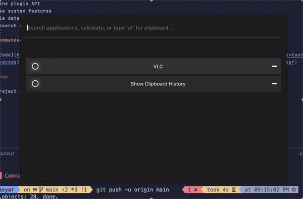

# Asyar - The open source alternative to Raycast

Asyar is a customizable and extensible Spotlight/Raycast alternative built with Tauri that **supports plugins**.



## Features

- 📱 Application search and launcher
- 📋 Clipboard history manager
- 🔄 Extensible plugin API
- ⚡️ Fast app switching
- 🔌 Plugin system for extensibility
- 🎨 Clean, minimal interface
- 🚀 Native performance with Tauri

## Plugins

- 🧮 calculator plugin
- 👋 greeting plugin: this plugin shows how to create a simple view and register a command.

## Notice

This application is in the very early stages of development and may change significantly in the future.

## Getting Started

1. Clone and install dependencies:

```
git clone https://github.com/Xoshbin/asyar.git
cd asyar
pnpm install
```

2. Run the application:

```
pnpm tauri dev
```

3. Press <kbd>Cmd</kbd><kbd>k</kbd> to toggle the asyar window

## Plugin Development

Asyar supports a powerful plugin system that allows you to extend its functionality. Check out our [Plugin Development Guide](./docs/plugin-development.md) to learn how to:

## Contributing

Contributions are welcome! If you'd like to contribute to Asyar, please follow these guidelines:

1.  Fork the repository.
2.  Create a new branch for your feature or bug fix.
3.  Submit a pull request with a clear description of your changes.

### Plugin Contributions

If you'd like to contribute a plugin to Asyar, please follow these guidelines:

1.  Create a new plugin following the [Plugin Development Guide](./docs/plugin-development.md).
2.  Submit a pull request with a clear description of your plugin and its functionality.

## TODO

- [ ] Add more default plugins
- [ ] Improve documentation
- [ ] Add settings page
- [ ] Add ability to change theme
- [ ] Add ability to change hotkey
- [ ] Improve application architecture
- [ ] Enhance plugin manager and application APIs
- [ ] Write tests

# License

This project is licensed under the GNU Affero General Public License Version 3 (AGPL-3.0). See the [LICENSE](./LICENSE.md) file for details.
