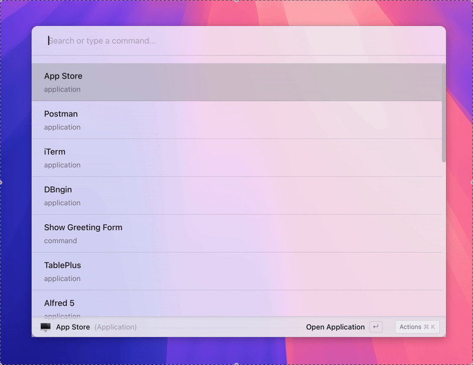

# Asyar

**An open-source alternative to Raycast.**

Asyar is a fast, extensible command launcher built with modern web technologies. It allows you to quickly search for applications, run commands, access clipboard history, and much more through a growing ecosystem of extensions.

Built with [Tauri](https://tauri.app/), [SvelteKit](https://kit.svelte.dev/), and [TypeScript](https://www.typescriptlang.org/).



---

**⚠️ Disclaimer: Not Production Ready ⚠️**

**Asyar is currently under active development and is NOT considered stable or production-ready.** The codebase is evolving, and you may encounter bugs or breaking changes. The code is also in need of significant refactoring. Use at your own risk!

---

## Current Status & Contributing

The `main` branch represents the current development state. However, the `store` branch is significantly ahead, focusing on implementing an extension store and pushing towards a more stable, production-ready state.

**Contributions are highly welcome!** We especially need help on the `store` branch to improve stability, refactor the codebase, and get Asyar ready for wider use. If you're interested in contributing, please check out the `store` branch.

## Features

- **Application Launcher:** Quickly find and launch installed applications.
- **Command Execution:** Run custom commands defined by extensions.
- **Extensible:** Add new functionality through a simple extension API provided by the [asyar-api SDK](https://github.com/Xoshbin/asyar-sdk). See the [Extension Development Guide](docs/extension-development.md) for details on creating your own extensions.
- **Clipboard History:** (Via built-in extension) Access and search your clipboard history.
- **Modern Tech Stack:** Leverages the speed and safety of Rust (Tauri backend) and the efficiency of SvelteKit (frontend).

## Development Setup

### Prerequisites

- [Node.js](https://nodejs.org/) (which includes npm)
- [Rust](https://www.rust-lang.org/tools/install) and Cargo
- Tauri prerequisites (see [Tauri documentation](https://tauri.app/v1/guides/getting-started/prerequisites))

### Installation

1.  Clone the repository:

```bash
git clone https://github.com/Xoshbin/asyar.git
```

2.  Clone the asyar-api repository inside the asyar project directory:

```bash
cd asyar
git clone https://github.com/Xoshbin/asyar-sdk.git asyar-api
```

3.  Install dependencies:

```bash
# Using the clean install scripts (recommended)
cd asyar-api && ./clean-install.sh && cd .. && ./clean-install.sh && pnpm tauri dev
```

This command sequence:

- First installs and builds the asyar-api SDK dependencies using its clean install script
- Returns to the main project directory and runs its clean install script
- Launches the application in development mode

The clean install scripts ensure proper dependency resolution and avoid common package conflicts.

### Running the App

> **Note:** For the app to run correctly, the [asyar-api SDK](https://github.com/Xoshbin/asyar-sdk) repository must be placed directly in the project directory next to the src directory.

- **Development Mode:**
  ```bash
  pnpm tauri dev
  # or npm run tauri dev
  ```

## Recommended IDE Setup

[VS Code](https://code.visualstudio.com/) + [Svelte](https://marketplace.visualstudio.com/items?itemName=svelte.svelte-vscode) + [Tauri](https://marketplace.visualstudio.com/items?itemName=tauri-apps.tauri-vscode) + [rust-analyzer](https://marketplace.visualstudio.com/items?itemName=rust-lang.rust-analyzer).

## License

Distributed under the AGPLv3 License. See LICENSE.md for more information.
