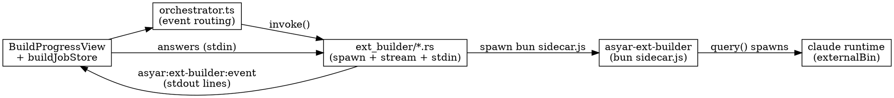

# AI Extension Builder — How a Prompt Becomes a Working Extension

This page explains the **"Build Extension with AI"** feature for contributors:
how the launcher-side orchestration and the bundled coding sidecar fit together,
the stdio protocol between them, the feasibility gate, the security model, and the
packaging constraint that shapes the whole design. For the *user-facing* how-to,
see [Use the Create Extension tool](../how-to/use-create-extension-tool.md).

It builds on the [two-tier model](./two-tier-model.md): the orchestration is a
**Tier 1 built-in feature**; the actual code-writing happens in a **separate
sidecar process**.

## Two halves, one feature

The feature is split across a process boundary because the two halves live in
different worlds:

| Half | Where it runs | Responsibility |
|---|---|---|
| **Orchestrator** (Tier 1) | The launcher WebView ([`src/built-in-features/create-extension/ai-builder/`](../../asyar-launcher/src/built-in-features/create-extension/ai-builder/)) | UI, job state, notifications, deep-links, secret-scan, register + activate |
| **Sidecar** (`asyar-ext-builder`) | Its own OS process ([`asyar-ext-builder/`](../../asyar-ext-builder/)) | Runs the Claude Agent SDK: feasibility gate, scaffold, code, `pnpm` build loop, smoke test |

The WebView cannot spawn native processes, run `pnpm`, or do raw filesystem/shell
work — so the coding muscle has to be a child process. This mirrors how MCP ships
`bun`/`uv` sidecars.

The Rust bridge ([`ext_builder/process.rs`](../../asyar-launcher/src-tauri/src/ext_builder/process.rs))
spawns the sidecar, streams each stdout line as the `asyar:ext-builder:event` Tauri
event, and forwards answers to the sidecar's stdin. The orchestrator parses each
line and drives the single active job in
[`buildJobStore.svelte.ts`](../../asyar-launcher/src/built-in-features/create-extension/ai-builder/buildJobStore.svelte.ts)
(states `working`/`waiting`/`done`/`failed`); the progress view is a pure window
onto that store.

## The stdio protocol

Communication is newline-delimited JSON, defined identically on both sides
([`buildProtocol.ts`](../../asyar-launcher/src/built-in-features/create-extension/ai-builder/buildProtocol.ts)
↔ sidecar `protocol.ts`).

| Direction | Event | Meaning |
|---|---|---|
| sidecar → launcher | `verdict` | feasibility result, emitted **before any file is written** |
| | `step` | progress label for the live view |
| | `ask` | a question — pauses the job, fires a notification deep-link |
| | `done` | extension built + verified (carries id, path, smoke summary) |
| | `fail` | a step failed (carries step, error, log) |
| launcher → sidecar | `answer` | the user's reply to an `ask` (written to stdin) |
| | `cancel` | abort the build |

**Questions are events, not a phase.** Whether the agent needs a clarification
early or deep in the build, it emits `ask`; the job goes to `waiting`, a
notification deep-links the user to the view to answer, and the answer resumes the
job. The user can leave and return freely — the job outlives the view.

## Feasibility gate

The gate is the sidecar's first action and is emitted as a `verdict` **before any
file is written** — so an impossible request stops having touched nothing. It
reasons against a curated capability spec
([`capabilitySpec/capabilities.json`](../../asyar-launcher/src/built-in-features/create-extension/ai-builder/capabilitySpec/capabilities.json)),
which is kept honest by a test that fails if it drifts from the SDK's authoritative
`VALID_PERMISSIONS` (`asyar-sdk/cli/lib/manifest.ts`). The capability list and the
authoring guide stay **local** (the gate's correctness must not depend on a network
fetch).

## Knowledge from live URLs

The agent's *example* knowledge is **not** bundled. `knowledgeSources.json` (inlined
into `sidecar.js` at build) lists canonical raw-GitHub URLs of real example
extensions + docs; the agent `WebFetch`es them on demand for patterns (non-fatal if
unreachable). The rule: **live-fetch only what already exists elsewhere; keep local
what doesn't** (the capability/permission contract has no canonical external URL, so
it stays local).

## Security model

The build inherently runs author-controlled code (`pnpm install` runs the agent's
`package.json` scripts), so containment is layered:

- **Bash command allowlist.** Bash is deliberately kept **out** of the Agent SDK's
  `allowedTools` (tools in `allowedTools` bypass the permission hook) and routed
  through a `canUseTool` hook backed by a fail-closed allowlist
  (`isAllowedBashCommand` in the sidecar's `utils.ts`): only `pnpm`/`npm` build
  subcommands + `mkdir`/`ls`, never `dlx`/`exec`/install-from-URL. This contains
  prompt-injection from fetched docs.
- **Secret scan in Rust.** A build-time third-party key (used only for the verify
  smoke test) is scanned out of the generated files by
  [`ext_builder/secret_scan.rs`](../../asyar-launcher/src-tauri/src/ext_builder/secret_scan.rs)
  — Rust, not the WebView, because the build dir (`~/AsyarExtensions/<id>`) is outside
  the WebView's filesystem capability allowlist. If the key appears verbatim in any
  file, the build fails closed.
- **Path-traversal guards** on the chosen extension id, in both the sidecar and the
  Rust `register_dev_extension` command (defense in depth).
- **Residual:** `pnpm run build` still executes the agent's build script. This is the
  same risk as building any cloned repo; it's surfaced in-UI. OS-level sandboxing
  (e.g. `sandbox-exec`) is a tracked follow-up, not yet implemented.

## Packaging constraint (read before touching the sidecar)

The Claude Agent SDK's `query()` **spawns a native `claude` binary (~215 MB)** as a
subprocess — it is not a pure HTTP client. Two consequences shaped the design:

1. A `bun build --compile` single binary does **not** embed `claude`, and even with
   `pathToClaudeCodeExecutable` set it can't host the SDK's multi-turn build
   (in-process MCP + subprocess) from inside the compiled sandbox.
2. So the sidecar ships as a **bundled JS run by the already-bundled `bun`**:
   `bun build src/main.ts --target bun --outfile dist/sidecar.js` (inlines the whole
   SDK, ~1.6 MB), staged by `build.rs` into `src-tauri/resources/ext-builder/sidecar.js`.
   `process.rs` spawns `bun sidecar.js`; the `claude` binary ships as a Tauri
   `externalBin` and is passed via `CLAUDE_CODE_EXECUTABLE_PATH` →
   `options.pathToClaudeCodeExecutable`.

**Build-order requirement:** the release pipeline must run `bun run build:js` in
`asyar-ext-builder/` **before** `tauri build`, or an empty placeholder ships and the
feature is dead. `tauri dev` resolution falls back to `CARGO_MANIFEST_DIR/binaries`
+ `resources` so a local run works once `build:js` has run and real `bun`/`claude`
binaries exist under `src-tauri/binaries/`.

## After the build: My Extensions & Publish

- **My Extensions** ([`CreatedExtensionsView.svelte`](../../asyar-launcher/src/built-in-features/create-extension/ai-builder/CreatedExtensionsView.svelte))
  lists everything in `~/AsyarExtensions/` via the Rust
  [`list_created_extensions`](../../asyar-launcher/src-tauri/src/ext_builder/created.rs)
  command (the scan, sort, and search filter all live in Rust). Per-row actions reuse
  the open/publish helpers.
- **Publish to Asyar Store** confirms (it creates a public GitHub repo), then opens a
  terminal running `asyar publish` in the extension's directory — reusing the existing
  [CLI publish flow](../how-to/publishing.md) wholesale rather than reimplementing it.

## Source map

| Concern | File |
|---|---|
| Job state machine | `ai-builder/buildJobStore.svelte.ts` |
| Event routing | `ai-builder/orchestrator.ts` |
| Question ⇄ notification ⇄ stdin | `ai-builder/questionBridge.ts` |
| Progress view | `ai-builder/BuildProgressView.svelte` |
| Protocol types | `ai-builder/buildProtocol.ts` |
| Sidecar spawn / stream / stdin | `src-tauri/src/ext_builder/process.rs` |
| Tauri commands | `src-tauri/src/ext_builder/commands.rs` |
| Enumerate / search built extensions | `src-tauri/src/ext_builder/created.rs` |
| Secret scan (Rust) | `src-tauri/src/ext_builder/secret_scan.rs` |
| Sidecar entry + Agent SDK | `asyar-ext-builder/src/main.ts`, `builder.ts` |
| Bash allowlist | `asyar-ext-builder/src/utils.ts` |
