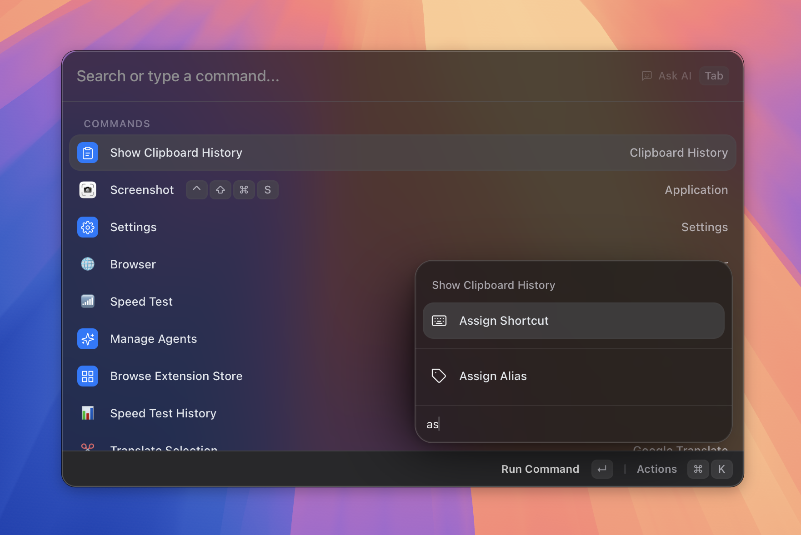

# Aliases & Shortcuts

> Custom triggers and global hotkeys for any command.

*Figure: the Applications tab assigning a shortcut or alias.*

## What it does

Asyar gives you two ways to reach any app or command faster:

- **Aliases** — a short word (1–10 lowercase letters or digits) that, when typed in the search bar, immediately runs the matching app or command. For example, set `c` as an alias for Chrome and typing `c` launches Chrome directly.
- **Shortcuts** — a global keyboard combination (for example `⌥⌘C`) assigned to any app or command. Press the hotkey from anywhere on your computer and Asyar runs the target immediately, without you needing to open the launcher first.

Both types are assigned per item — one alias and one shortcut per app or command. You can assign, change, or remove them at any time.

## How to use it

### Assigning an alias

**From search results (quickest way):**

1. Open Asyar and search for the app or command you want.
2. With the result highlighted, open the action panel with `⌘K`.
3. Choose **Assign Alias** (or **Change Alias** if one is already set).
4. Type 1–10 lowercase letters or digits and press `Enter` to save.

**From Settings:**

1. Open Settings (`⌘,` or search for "Settings") and go to the **Applications** or **Extensions** tab.
2. Find the app or command in the list. Click its **Alias** cell.
3. Type the alias and press `Enter`.

### Assigning a global shortcut

**From search results:**

1. Search for the app or command, highlight it, then press `⌘K`.
2. Choose **Assign Shortcut** (or **Change Shortcut**).
3. Press the key combination you want to assign. Asyar checks for conflicts and confirms.

**From Settings:**

1. Open **Settings → Applications** or **Settings → Extensions**.
2. Click the **Shortcut** cell next to the item.
3. Press the combination and save.

**To view all assigned shortcuts in one place**, search for `shortcuts` to open the Shortcuts view. Select any entry and choose **Change** or **Remove** from the action panel (`⌘K`).

### Removing an alias or shortcut

- In the Settings tabs, click the small remove button (×) next to the assigned alias or shortcut badge.
- In the Shortcuts view, select the entry and choose **Remove** from the action panel.

## Shortcuts & actions

The shortcuts and aliases themselves are configured via the action panel on search results and the Settings tabs — there are no dedicated keyboard shortcuts for the management views beyond the standard ones below.

**Action panel (⌘K) on any search result:**

- **Assign Alias** / **Change Alias** — opens the alias input for the highlighted item.

**Action panel (⌘K) on any search result or in the Shortcuts view:**

- **Assign Shortcut** / **Change Shortcut** — opens the shortcut recorder.

**Inside the Shortcuts view (search for `shortcuts`):**

| Action | How |
|--------|-----|
| Change shortcut | `⌘K` → **Change** |
| Remove shortcut | `⌘K` → **Remove** |

## Tips

- **Aliases rules** — an alias can only contain lowercase letters and digits (`a–z`, `0–9`) and must be 1–10 characters long. No spaces or symbols.
- **Conflict detection** — if the alias you type is already used by another item, Asyar asks if you want to reassign it.
- **Shortcuts vs aliases** — shortcuts work even when Asyar is hidden; aliases require you to open the launcher and type. Use shortcuts for the apps you reach dozens of times a day, aliases for everything else.
- **One alias per item** — each app or command can have only one alias, but the same alias cannot be shared.
- **Shortcuts view** — type `shortcuts` in the search bar to open a dedicated view that lists every shortcut you have assigned, grouped by Applications and Commands. It is handy for a quick audit.

## Related

- [The Basics](../the-basics.md)
- [Keyboard Shortcuts](../keyboard-shortcuts.md)
- [Window Management](./window-management.md)
- [Snippets](./snippets.md)
