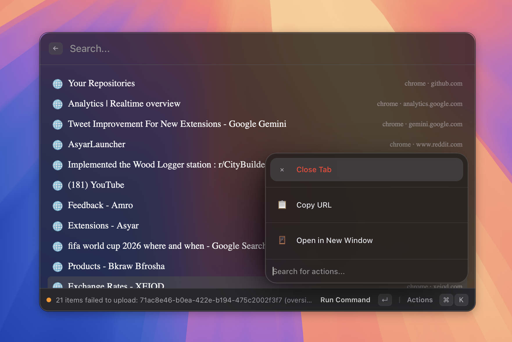

# Browser Integration

> Search bookmarks, history, and tabs.

*Figure: bookmark and tab results appearing in search.*
<!-- image-todo: feature-browser-hero.png — bookmark/tab results in search -->

## What it does
## How to use it
## Shortcuts & actions
## Tips
## Related
