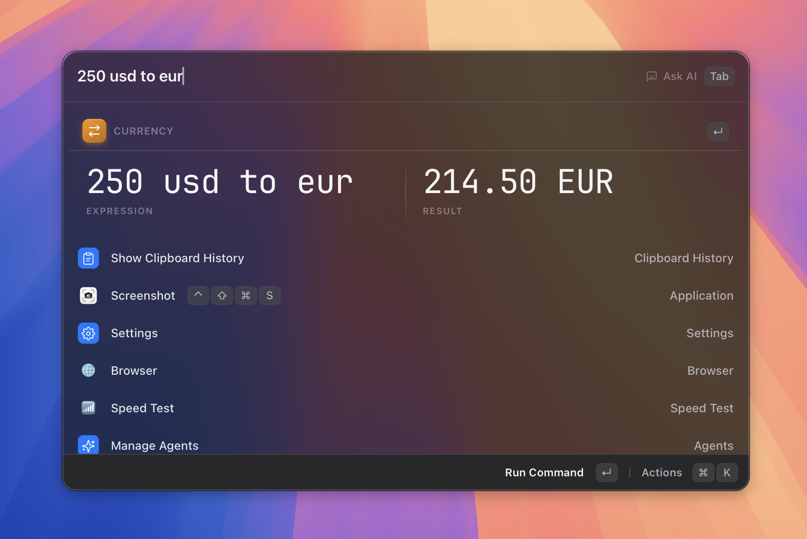

# Calculator

> Type an expression, a date question, or "time in tokyo" — get an instant answer, right in the search bar.

_Figure: type a sum and the answer appears inline, ready to copy._

## What it does

The Calculator evaluates what you type as you type it — no need to open a separate app, and no trigger word to remember. It goes well beyond arithmetic: percentages and tips, unit and currency conversion (including crypto), cooking measurements, natural-language dates ("days until christmas"), world clocks ("time in tokyo"), number bases, colors, and ratios are all understood in plain English.

Results appear pinned at the top of the list the moment an expression is recognized, showing the expression and the answer side by side. Pressing `Enter` copies the answer to your clipboard.

## How to use it

There is no trigger word — the calculator is always on. Just open Asyar with your global hotkey and start typing.

1. Type your expression — for example `15% of 240`, `5 kg to lbs`, `days until christmas`, or `time in tokyo`.
2. The result appears as the first item in the list, with the expression shown alongside it.
3. Press `Enter` to copy the result and dismiss the launcher. A brief notification confirms the copy.

For currency results, exchange rates (including crypto) are fetched in the background and cached, so conversions keep working even without a fresh connection — they just refresh automatically at the interval you set in preferences.

## Categories & examples

| Category           | Type                                                           | Get                                                 |
| ------------------ | -------------------------------------------------------------- | --------------------------------------------------- |
| Math               | `sqrt(625)`, `2 power 10`, `5!`                                | `25`, `1,024`, `120`                                |
| Percentages & tips | `20% off 80`, `15% tip on 42`, `12 is what % of 80`            | `64`, `48.30`, `15%`                                |
| Units              | `5'10" to cm`, `100 km to miles`, `1 GiB to MB`                | `177.8 cm`, `≈ 62.14 miles`, `1,073.741824 MB`      |
| Design sizes       | `2 inches in px at 72 ppi`                                     | `144 px`                                            |
| Cooking            | `1 tablespoon of honey in grams`, `2.5 cups of flour to grams` | `21 g`, `312.5 g`                                   |
| Currency           | `100 usd to eur`, `$1k in iqd`, `5 btc in gbp`                 | `90 EUR`, `1,310,000 IQD`, `316,000 GBP`            |
| Dates & durations  | `days until christmas`, `next friday`, `2026-01-31 + 1 month`  | `167 days`, a date, `28 Feb 2026`                   |
| World clocks       | `time in tokyo`, `5pm ldn in sf`, `time diff paris`            | current/converted time, a time difference           |
| Number bases       | `0xff`, `255 to hex`, `12 to binary`                           | `255`, `0xFF`, `0b1100`                             |
| Colors             | `#ff8800`, `#ff8800 to hsl`, `rgb(255, 136, 0)`                | `rgb(255, 136, 0)`, `hsl(32, 100%, 50%)`, `#FF8800` |
| Ratios & timespans | `ratio of 384 to 240`, `145 min to timespan`                   | `8 : 5`, `2 h 25 min`                               |

Math also understands wordy phrasing — `square root of 625`, `7 times 8`, `half of 10` — and amount shorthand like `10k`, `usd1k`, `$2.5m`. Cooking conversions cover common ingredients: water, milk, honey, flour, sugar, butter, oil, rice, salt, cocoa, oats, syrup, cream, yogurt, and peanut butter. Currency covers any ISO code plus the major cryptocurrencies (BTC, ETH, BNB, XRP, ADA, DOGE, LTC, DOT, TRX, LINK, BCH, XLM, USDT, USDC). World clocks recognize city abbreviations (`sf`, `nyc`, `ldn`), timezone abbreviations (`pst`, `cet`, `jst`, …), and full country names (`japan`, `chile`, `india`, …).

## Shortcuts & actions

| Action      | How                       |
| ----------- | ------------------------- |
| Copy result | `Enter` on the result row |

The calculator result row has no action panel (⌘K) entries — its single action is copy on `Enter`.

## Tips

- **Implicit currency** — type `50 usd` (no target currency) and Asyar converts it to your **Preferred currency** setting automatically.
- **Rate units convert too** — `8 dollars/hour in gbp` converts per-unit rates, not just flat amounts.
- **Date anchor** — use the word `today` in date math, for example `today + 45 days`.
- **Base literals** — paste a hex color like `0xFF8C00` and see its decimal, binary, and octal values side by side.
- **Your decimal mark** — type `61,78 * 1,19` and it means what you wrote. Asyar follows your system's region setting, so a comma-decimal locale reads commas as decimals and gets its answers grouped the same way (`73,5182`, `1.234.567`).
- **Currency refresh interval, preferred currency & number format** — go to Settings → Extensions → Calculator to change how often rates refresh (1–24 hours, default 6), which currency bare amounts convert to, and — if the detected region is not how you actually write numbers — the number format to read and render (Automatic, `1,234.56`, or `1.234,56`).

## Related

- [The Basics](../the-basics.md)
- [Snippets](./snippets.md)
- [Clipboard History](./clipboard-history.md)
