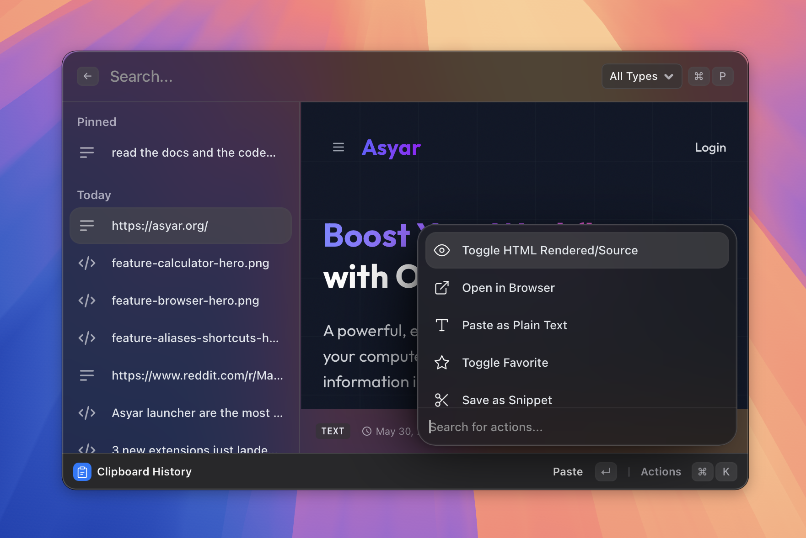

# Clipboard History

> Browse, filter, favorite, and paste past copies.

*Figure: the clipboard list with the type filter visible.*

## What it does

Clipboard History records everything you copy — text, rich text (HTML/RTF), images, and file paths — and lets you browse, search, filter, and paste any past entry. Favourited items are pinned at the top and survive the "clear history" action.

The list is grouped by time: Pinned, Today, Yesterday, This Week, This Month, Older. The detail pane on the right shows a full preview: plain text renders with Markdown highlighting, HTML can be viewed rendered or as raw source, images are shown as thumbnails, and copied URLs can be previewed inline.

Asyar also records which app each item came from, so you can see the source application (and window title) at the bottom of the detail pane.

## How to use it

1. Open Asyar and type `clip` — or select **Clipboard History** from search results.
2. The clipboard view opens. Use `↑` / `↓` to move through the list.
3. Type in the search bar to filter. Full-text search runs across all text entries.
4. To narrow by content type, click the dropdown in the search bar (or press `⌘P`) and choose **All Types**, **Text**, **Images**, or **Files**.
5. Press `Enter` to paste the selected item into the app that was in focus before you opened Asyar.
6. Press `⇧Enter` to paste as plain text, stripping any formatting.

## Shortcuts & actions

| Action | How |
|--------|-----|
| Paste | `Enter` |
| Paste as Plain Text | `⇧Enter` |
| Delete item | `⌘⌫` |
| Open action panel | `⌘K` |

**Action panel (⌘K) entries while the list is open:**

- **Paste as Plain Text** — strips formatting before pasting.
- **Toggle Favorite** — pins or unpins the selected item. Favourites are never deleted by "Clear Clipboard History".
- **Toggle HTML Rendered / Source** — switches the detail pane between rendered HTML and raw source (useful for HTML or RTF items).
- **Open in Browser** — opens a selected URL item in your default browser.
- **Save as Snippet** — sends the selected text item directly to the Snippets editor so you can give it a keyword.
- **Delete** — removes the selected item permanently (`⌘⌫`).
- **Ask AI about this** — opens AI Chat with the selected text pre-filled.
- **Clear Clipboard History** — removes all non-favourited items (available from the root search bar too, without opening the view).

## Tips

- **Favourites survive clears** — star anything you want to keep forever before running "Clear Clipboard History".
- **Double-click to paste** — clicking an item selects it; double-clicking pastes it immediately.
- **RTF items** — Asyar stores the rich format but "Paste as Plain Text" strips it, which is handy for pasting into apps that don't accept rich text.
- **Large text is truncated in the preview** — the full content is always pasted correctly; the preview just caps at 50,000 characters to keep the UI fast.

## Related

- [The Basics](../the-basics.md)
- [Snippets](./snippets.md)
- [AI and Agents](./ai-and-agents.md)
