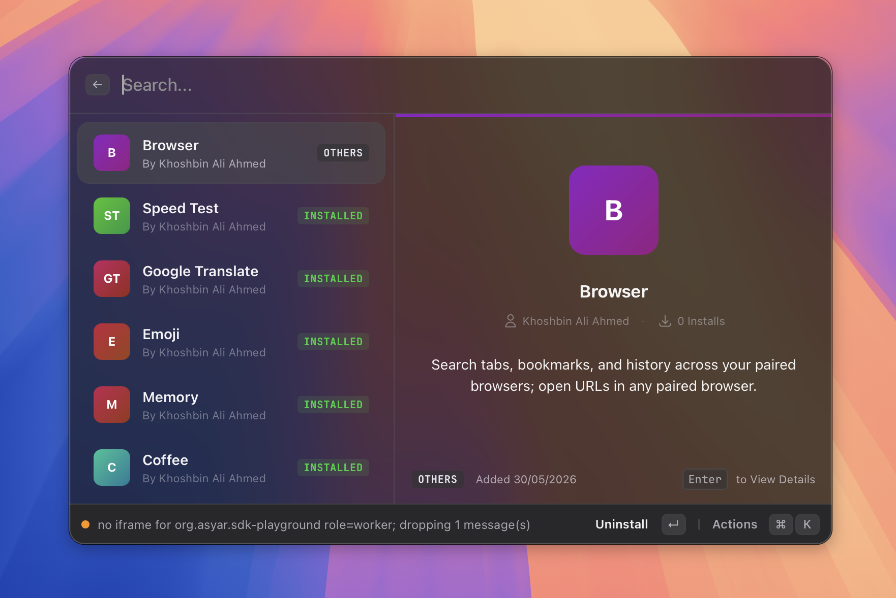

# Extensions

> Browse, install, and manage extensions from the store.

*Figure: the Extension Store view.*

## What it does

Extensions add new commands and search results to Asyar. The built-in features you see out of the box — calculator, clipboard history, scripts, browser integration, and others — are all extensions under the hood. You can find more through the Extension Store.

The **Extensions** settings tab gives you a full list of everything installed: you can enable or disable each extension, view its commands, assign aliases and hotkeys to individual commands, and uninstall extensions you no longer need.

The Extension Store (`store` command) is where you go to find and install new extensions. It is currently in early development, so the selection may be limited.

If Developer Mode is enabled, you can also sideload an extension directly from a local file.

## How to use it

### Browse and install from the store

1. Open Asyar and type **store** (or search for **Browse Extension Store**).
2. Press `Enter` to open the store.
3. Browse available extensions and follow the on-screen prompts to install one.

### Enable or disable an extension

1. Open Settings (`⌘,`) and go to the **Extensions** tab.
2. Find the extension in the list and use the toggle in the **Enabled** column to turn it on or off.

### Manage commands, aliases, and hotkeys

1. In Settings → Extensions, click the chevron next to an extension to expand its commands.
2. Select a command row to see its details in the right-hand panel.
3. In the **Alias** column, click **Add Alias** to assign a short keyword that triggers this command directly from the search bar.
4. In the **Hotkey** column, click **Record Hotkey** to assign a global keyboard shortcut to the command.
5. To remove an alias or hotkey, click the × next to it.

### Filter the list

Use the filter chips at the top of the Extensions tab to show **All**, **Commands**, **Extensions**, or **Themes**.

### Sideload from a file (Developer mode required)

1. Enable **Developer Mode** in **Settings → Advanced**.
2. In Settings → Extensions, click the **+** button in the toolbar.
3. Choose **Install from File…** and select the extension package.
4. Restart Asyar to activate the new extension.

### Uninstall an extension

1. Select the extension row in Settings → Extensions.
2. In the detail panel on the right, click **Uninstall**.

## Shortcuts & actions

| Action | How |
|---|---|
| Open the Extension Store | Type `store` → `Enter` |
| Enable / disable an extension | Settings → Extensions → toggle |
| Add an alias to a command | Settings → Extensions → expand extension → **Add Alias** |
| Record a hotkey for a command | Settings → Extensions → expand extension → **Record Hotkey** |
| Sideload from file | Settings → Extensions → **+** → **Install from File…** (Developer mode) |
| Uninstall an extension | Settings → Extensions → select extension → **Uninstall** in detail panel |

## Tips

- Asyar ships official first-party extensions in the Store alongside community-made ones. For example, the **Emoji** extension adds a full emoji & symbols picker and registers `:shortcode:` expansions — type `:party:` anywhere and it expands to the emoji. See [Snippets](./snippets.md) for details on how shortcode expansion works.
- Disabling an extension removes all of its commands from the search results but keeps the extension installed. You can re-enable it at any time.
- Aliases let you trigger any command with a short word you choose. For example, you could assign the alias `g` to a specific search command so typing `g` in the launcher goes straight to it.
- Hotkeys are global keyboard shortcuts that run a command without opening the launcher first. They work even when Asyar's window is hidden.
- If an extension update is available, an **Update** link appears next to its name. You can update individual extensions or use **Update All** if several have updates at once.
- The Extension Store is still being built out. If you are a developer and want to publish an extension, check the developer documentation.

## Related

- [Scripts](./scripts.md)
- [Browser Integration](./browser-integration.md)
- [Settings](../settings.md)
