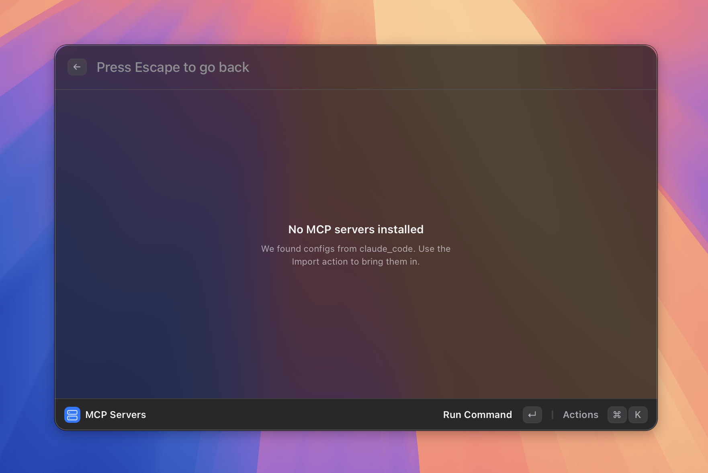

# MCP

> Connect external tools to your agents.

*Figure: the Manage MCP Servers view.*
<!-- image-todo: feature-mcp-hero.png — Manage MCP Servers view -->

## What it does

MCP (Model Context Protocol) servers are external programs that expose tools — things like reading files, querying databases, calling APIs, or running web searches. When you connect an MCP server to Asyar, its tools become available to your agents. You pick which tools each agent is allowed to use in the agent editor.

Asyar supports two ways to connect an MCP server: **stdio** (a local process you start via a command) and **HTTP** (a remote server you reach by URL).

When an agent calls an MCP tool, Asyar can ask your permission first. You can allow the call once, allow it always, or deny it. Saved permission decisions live in the **Permissions** view so you can review and revoke them.

## How to use it

### Install a new server manually

1. Search for **Install MCP Server** in Asyar and press `Enter`.
2. Fill in the form:
   - **ID** — a short unique name for this server (e.g. `my-server`).
   - **Display Name** — the label shown in the UI.
   - **Transport** — choose **Stdio** (local process) or **HTTP** (remote URL).
   - For Stdio: enter the **Command** to run (e.g. `npx`) plus any **Arguments** and **Environment Variables**.
   - For HTTP: enter the server **URL** and any required **Headers**.
3. Click **Test Connection** to verify the server starts and lists its tools.
4. Click **Install**.

### Import from an existing config

If you already use MCP servers in another app (such as Claude Desktop), Asyar can detect those configs automatically:

1. Search for **Import MCP Servers** and press `Enter`.
2. On the **From Detected Configs** tab, tick the servers you want to bring in and click **Import Selected**.
3. Alternatively, switch to the **Paste JSON** tab, paste your config JSON, click **Parse**, then select and import.

### Manage installed servers

1. Search for **Manage MCP Servers** and press `Enter`.
2. Each server shows its current status (starting, connected, failed, or disabled) and how many tools it exposes.
3. You can enable or disable individual servers from this view.

### Assign tools to an agent

1. Open **Manage Agents**, select an agent, and open it in the editor (`⌘K` → **Edit Agent**, or create a new one).
2. In the **Tools** section, check the MCP tools you want the agent to be able to use.
3. Save the agent.

### Strict mode

When strict mode is on, every MCP tool call asks for your permission — even for tools you previously allowed. The badge **Strict** appears in the top-right of the Manage Servers view when strict mode is active.

## Shortcuts & actions

| Action | How |
|---|---|
| Open server list | Search "Manage MCP Servers" → `Enter` |
| Install a new server | Search "Install MCP Server" → `Enter` |
| Import from existing configs | Search "Import MCP Servers" → `Enter` |
| Go back | `Esc` |

## Tips

- After installing a server, edit the relevant agent and check the new tools in the **Tools** picker. Tools are grouped by server.
- If **Test Connection** shows an error, double-check the command path (use an absolute path if needed) and that any required environment variables are filled in.
- Saved permission decisions (allow always / never) persist across restarts. Review them in the **Permissions** view, which is accessible from the Manage Servers view.
- You can import servers from multiple sources at once using the detected-configs tab — Asyar shows which config file each server came from so you know where it originated.

## Related

- [AI & Agents](./ai-and-agents.md)
- [Settings](../settings.md)
