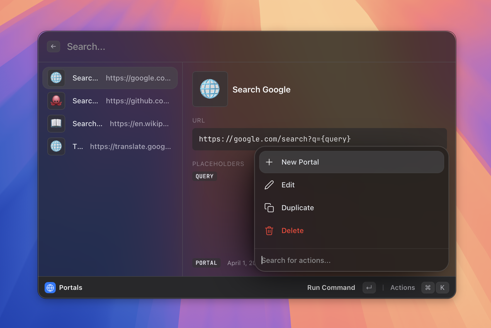

# Portals

> Save URLs as named launchers you can find by name.

*Figure: a portal result appearing in search.*
<!-- image-todo: feature-portals-hero.png — a portal result in search -->

## What it does
## How to use it
## Shortcuts & actions
## Tips
## Related
