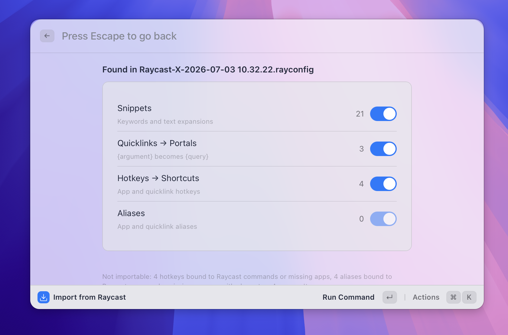

# Import from Raycast

> Bring your snippets, quicklinks, and app hotkeys over from Raycast in one step.

_Figure: the preview screen showing how many items were found in each category._

## What it does

The Raycast importer reads an export file from Raycast and turns it into Asyar snippets, portals, shortcuts, and aliases — so switching over doesn't mean rebuilding everything by hand.

It accepts three kinds of files:

- **Raycast export (`.rayconfig`)** — the file created by Raycast's **Export Settings & Data** command. Works whether or not you set an export password.
- **Classic Raycast export (`.rayconfig`)** — the older export format from Raycast's original macOS app.
- **Plain JSON exports** — the files created by Raycast's **Export Snippets** or **Export Quicklinks** commands.

Each Raycast item type maps to an Asyar equivalent:

| Raycast                          | Becomes in Asyar                             |
| -------------------------------- | -------------------------------------------- |
| Snippets (with keyword and text) | [Snippets](./snippets.md)                    |
| Quicklinks                       | [Portals](./portals.md)                      |
| App hotkeys                      | [Item shortcuts](./aliases-and-shortcuts.md) |
| App and quicklink aliases        | [Aliases](./aliases-and-shortcuts.md)        |

Hotkeys and aliases bound to Raycast's own built-in commands or third-party extensions have no Asyar equivalent and are not imported — Asyar shows how many were skipped so nothing silently disappears.

## How to use it

**To start an import**, use any of these:

1. Open Asyar and search for **Import from Raycast**, or
2. Open **Settings → Backup** and click **Import from Raycast…**, or
3. On your very first run, use the **Coming from Raycast?** button on the Welcome screen.

**Then, in the import view:**

1. Click **Choose export file…** and select your Raycast export.
2. If the file is password-protected, enter the password you set in Raycast when you exported it.
3. Review the preview screen — it shows how many Snippets, Portals, Shortcuts, and Aliases were found. Turn off any category you don't want to bring in.
4. Click **Import**. A summary shows how many items were added versus skipped as duplicates.

You can run the importer more than once — items that already exist in Asyar (matched by name and content for snippets, name and URL for portals) are skipped rather than duplicated, so re-running it after adding more things in Raycast is safe.

## Tips

- **Placeholders carry over** — Raycast's `{argument}` and `{Query}` tokens become Asyar's `{query}`; `{clipboard}` becomes `{Clipboard Text}`. Unrecognized tokens are left as-is rather than dropped.
- **Only installed apps get hotkeys/aliases** — an app hotkey or alias only imports if the app is actually installed and indexed on this computer.
- **Alias rules still apply** — an alias must be 1–10 lowercase letters or digits (see [Aliases & Shortcuts](./aliases-and-shortcuts.md)). A Raycast alias with other characters is skipped rather than imported broken.
- **Nothing is deleted from Raycast** — importing only reads the export file; your Raycast setup is untouched.

## Related

- [Snippets](./snippets.md)
- [Portals](./portals.md)
- [Aliases & Shortcuts](./aliases-and-shortcuts.md)
- [Settings](../settings.md)
