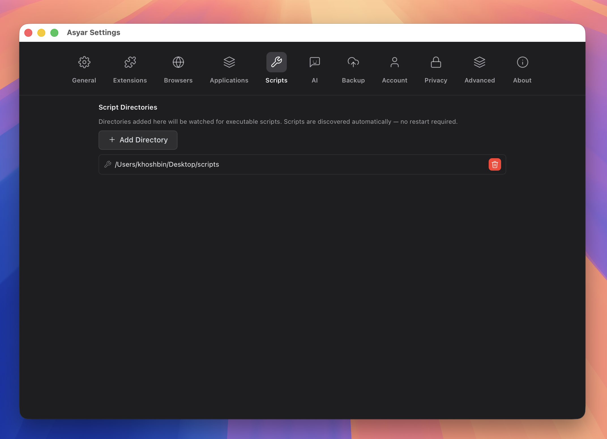

# Scripts

> Run shell scripts from watched folders.


*Figure: the Scripts settings tab with watched folders configured.*

## What it does

Scripts lets you run any executable shell script directly from the Asyar search bar. You tell Asyar which folders to watch, and every executable script inside those folders becomes a command you can search and run — no restart needed. When you add or remove scripts from a watched folder, Asyar picks up the change automatically.

Scripts can optionally declare a title, icon, and up to three input arguments in a header comment at the top of the file. An `inline` mode is also available: the script runs on a timer and its output appears as a live subtitle on the command row in search results.

## How to use it

**Step 1 — add a watched folder**

1. Open Settings (`⌘,`).
2. Go to the **Scripts** tab.
3. Click **Add Directory** and choose the folder that contains your scripts.

The folder now appears in the list. Asyar watches it for changes — you can add more folders the same way.

**Step 2 — run a script**

1. Open Asyar with your global hotkey.
2. Type the script name (or the title you set in its header).
3. Select the script in the results and press `Enter`.

If the script declares arguments in its header, Asyar will prompt you for them before running.

**Step 3 — optional: add a header**

Add metadata comments at the top of your script so Asyar can display a better title, icon, and inputs:

```sh
#!/bin/bash
# @asyar.title My Script
# @asyar.icon icon:terminal
# @asyar.argument:1 { "name": "target", "type": "text", "required": true }
```

Available header directives:

- `@asyar.title` — display name shown in search results (falls back to filename).
- `@asyar.icon` — icon shown next to the command.
- `@asyar.mode` — execution mode: `silent`, `compact` (default), `fullOutput`, or `inline`.
- `@asyar.refreshTime` — for `inline` mode, how often to re-run the script and update its subtitle (e.g. `30s`, `5m`, `2h`, `1d`). Minimum is 10 seconds.
- `@asyar.argument:1` through `@asyar.argument:3` — up to three typed inputs for the script.

## Shortcuts & actions

| Action | How |
|---|---|
| Run a script | Select it and press `Enter` |
| Open Manage Scripts view | Search for **Manage Scripts** and press `Enter` |
| Remove a watched folder | Settings → Scripts → trash icon next to the folder |

## Tips

- Scripts must be **executable** (run `chmod +x yourscript.sh` in Terminal) to be picked up by Asyar.
- You do not need to restart Asyar after adding scripts or folders — the watcher updates automatically.
- Inline scripts (mode `inline`) are useful for live data like battery level, VPN status, or git branch. Up to 10 inline scripts can auto-refresh at a time; additional ones still run manually.
- If Asyar warns that a refresh time was raised to 10 seconds, it means your `@asyar.refreshTime` value was below the 10-second minimum floor.
- Scripts run with the `shell:spawn` permission, which allows Asyar to launch child processes on your behalf.

## Related

- [Settings](../settings.md)
- [Extensions](./extensions.md)
