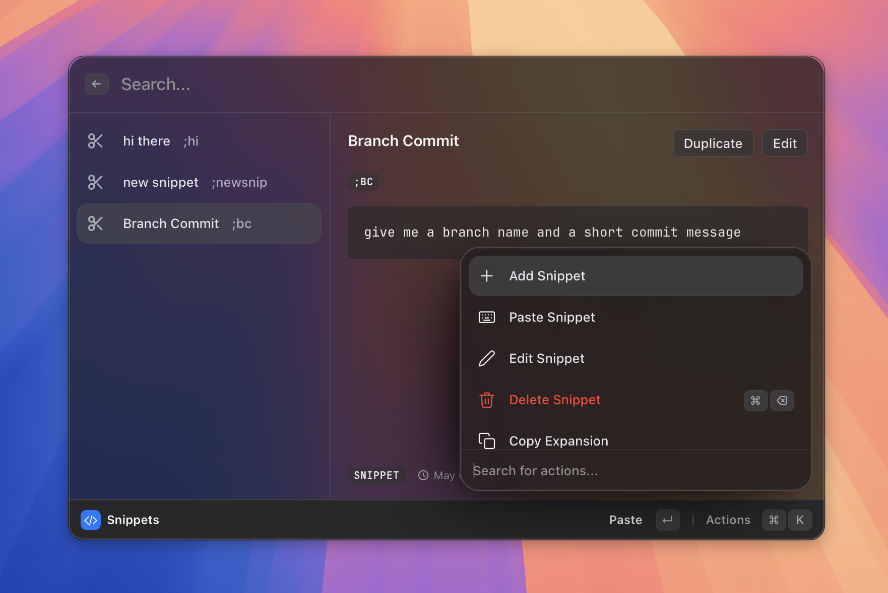

# Snippets

> Text expansion: type a keyword, paste the full text.

*Figure: the snippets list view.*
<!-- image-todo: feature-snippets-hero.png — snippets list view -->

## What it does
## How to use it
## Shortcuts & actions
## Tips
## Related
