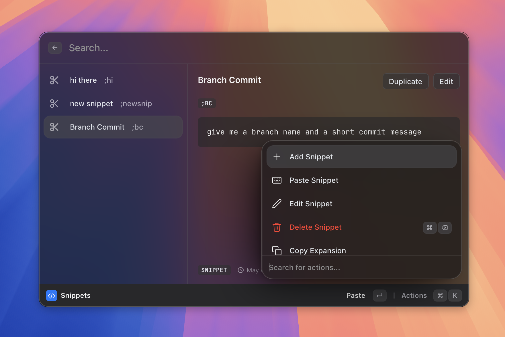

# Snippets

> Text expansion: type a keyword, paste the full text.

_Figure: the snippets list view._

## What it does

Snippets let you expand a short keyword into a longer piece of text — anywhere on your computer, in any app. For example, type `;email` and it expands to your full email address, or `;sig` becomes your email signature.

Expansion happens in the background as soon as you type the keyword followed by a space or other word-boundary character. You do not need to open Asyar first.

Snippets also support dynamic placeholders inside the expansion text (such as `{Date}`, `{Time}`, `{Selected Text}`, etc.), with optional custom format attributes. These are resolved at the moment you trigger the snippet.

## Dynamic placeholders & formatting

| Placeholder        | Description                                  | Example output                         |
| ------------------ | -------------------------------------------- | -------------------------------------- |
| `{Selected Text}`  | Text currently selected in the frontmost app | `selected text`                        |
| `{Clipboard Text}` | Current text content of your clipboard       | `copied text`                          |
| `{UUID}`           | Randomly generated UUID v4                   | `9b1deb4d-3b7d-4bad-9bdd-2b0d7b3dcb6d` |
| `{Date}`           | Today's date (default format)                | `8/25/2026`                            |
| `{Time}`           | Current time (default format)                | `3:45:00 PM`                           |
| `{Date & Time}`    | Today's date and time (default format)       | `8/25/2026, 3:45:00 PM`                |
| `{Weekday}`        | Current day name                             | `Tuesday`                              |

### Custom date & time formats

You can customize the output format by specifying a `format="..."` attribute:

- **ISO Date**: `{Date format="YYYY-MM-DD"}` → `2026-08-25`
- **European Date**: `{Date format="dd/MM/yyyy"}` → `25/08/2026`
- **Long Textual Date**: `{Date format="MMMM d, yyyy"}` → `August 25, 2026`
- **24-Hour Time**: `{Time format="HH:mm"}` → `14:30`
- **12-Hour Time with AM/PM**: `{Time format="hh:mm a"}` → `02:30 PM`
- **Full Timestamp**: `{Date & Time format="YYYY-MM-DD HH:mm:ss"}` → `2026-08-25 14:30:00`
- **Abbreviated Day**: `{Weekday format="EEE"}` → `Tue`

Standard formatting tokens (`YYYY`, `yyyy`, `MMMM`, `MMM`, `MM`, `dd`, `d`, `HH`, `hh`, `mm`, `ss`, `a`, `SSS`, `Z`) as well as native `strftime` patterns (e.g. `%Y-%m-%d`) are supported.

> **Note (macOS only):** Background text expansion requires the macOS Accessibility permission. If you have not granted it yet, Asyar will show a warning banner inside the Snippets view with a button to open System Settings. On Windows and Linux this permission is not required — expansion works without any extra setup.

## How to use it

**To browse and paste your snippets from the launcher:**

1. Open Asyar and type `snippets` to open the Snippets view.
2. Use `↑` / `↓` to move between snippets, or type in the search bar to filter.
3. Press `Enter` to paste the selected snippet's expansion into the frontmost app.

**To add a new snippet:**

1. Open the Snippets view and press `⌘N` (or open the action panel with `⌘K` and choose **Add Snippet**).
2. Fill in the **Name** (required), an optional **Keyword**, and the **Expansion** text.
3. To insert a dynamic placeholder, type `{` in the expansion field to open the placeholder picker, or click the `{ }` button next to the field.
4. Press **Save** (or `⌘S`).

**To delete a snippet:**

1. Select the snippet in the list.
2. Open the action panel with `⌘K` and choose **Delete Snippet** — a confirmation dialog appears before the snippet is permanently removed.

## Shortcuts & actions

| Action                 | How     |
| ---------------------- | ------- |
| Add snippet            | `⌘N`    |
| Paste selected snippet | `Enter` |
| Save form              | `⌘S`    |
| Cancel form            | `Esc`   |
| Open action panel      | `⌘K`    |

**Action panel (⌘K) entries while the view is open:**

- **Add Snippet** — open the new-snippet form.
- **Paste Snippet** — paste the selected snippet's expansion.
- **Edit Snippet** — open the edit form for the selected snippet.
- **Delete Snippet** — delete with confirmation.
- **Copy Expansion** — copy the expansion text to the clipboard without pasting.
- **Duplicate Snippet** — create a copy with an auto-suffixed keyword.
- **Pin / Unpin Snippet** — pin a snippet to the top of the list.
- **Clear All Snippets** — remove every snippet (with confirmation).

## Tips

- **Keyword conventions** — use a prefix like `;` or `/` to avoid accidental triggers (for example `;addr` instead of just `addr`). Keep keywords short and distinctive so they're easy to recall.
- **No keyword needed** — you can leave the keyword blank and still paste the snippet manually from the launcher view using `Enter`.
- **Dynamic placeholders** — type `{` in the expansion field while creating or editing to browse all available placeholders. The picker inserts the correct `{token}` syntax for you.
- **Pinned snippets** — pin frequently used snippets so they always appear at the top of the list regardless of search.
- **Save from clipboard** — if you see something in Clipboard History that you want to reuse often, use **Save as Snippet** in the clipboard action panel (`⌘K`) to open it pre-filled in the snippet editor.

## Emoji shortcodes

If you install the official **Emoji extension** from the Store, it registers an emoji dictionary into Asyar's built-in inline expansion engine. Once installed, you can type a `:shortcode:` anywhere — like `:party:` — and it expands to the matching emoji in any app, just like your own text snippets.

Unknown shortcodes are not just ignored: Asyar can ask your AI provider to look up the right emoji and remember it for next time.

To get started:

1. Open Asyar and type **store** → `Enter`.
2. Find the **Emoji** extension and install it.
3. Start typing `:shortcode:` anywhere — for example `:thumbsup:` or `:rocket:`.

The expansion engine itself is built into Asyar; the emoji dictionary comes from the Emoji extension, so shortcodes only work after you install it.

## Related

- [The Basics](../the-basics.md)
- [Clipboard History](./clipboard-history.md)
- [Aliases & Shortcuts](./aliases-and-shortcuts.md)
- [Extensions](./extensions.md)
- [Import from Raycast](./raycast-import.md) — bring your existing snippets over instead of recreating them
