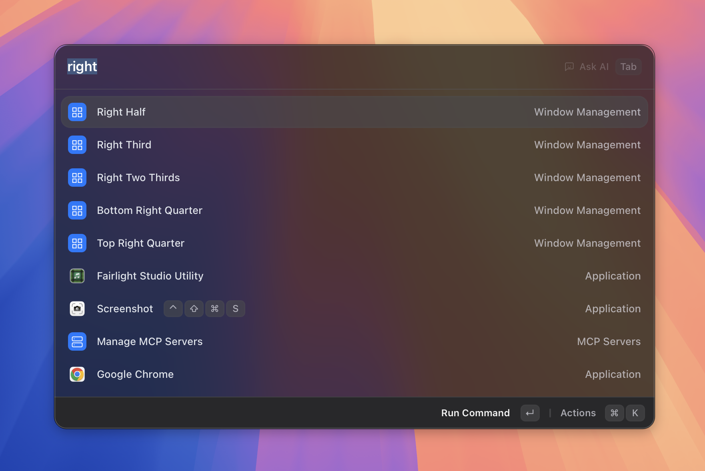

# Window Management

> Resize and arrange windows with layout presets.

*Figure: the layout presets list.*
<!-- image-todo: feature-window-management-hero.png — layout presets list -->

## What it does

Window Management lets you instantly resize and reposition any window using named layout presets — without touching the mouse. You pick a layout by name from the Asyar search bar, and the frontmost window snaps to that position. A brief heads-up notification confirms the layout that was applied, and you can always undo the last move with **Restore Previous Bounds**.

You can also save your own custom layouts by capturing any window's current size and position.

## How to use it

**To apply a built-in preset:**

1. Switch to the app whose window you want to resize.
2. Open Asyar with your global hotkey.
3. Type part of the layout name — for example `left half`, `top right quarter`, or `maximize`.
4. Select the matching result and press `Enter`. The window snaps immediately and Asyar dismisses.

**To undo the last layout:**

- Type `restore` in the search bar and press `Enter`, or search for **Restore Previous Bounds**.

**To manage custom layouts:**

1. Type `manage window layouts` and press `Enter` to open the **Manage Window Layouts** view.
2. From here, open the action panel with `⌘K` and choose **Save Current Window as Layout** to capture the frontmost window's current position and size.
3. To delete a custom layout, select it in the list and choose **Delete** from the action panel (`⌘K`).

## Shortcuts & actions

| Action | How |
|--------|-----|
| Apply any preset | Search its name, then `Enter` |
| Undo last layout | Search `restore`, then `Enter` |
| Open action panel | `⌘K` (in Manage Layouts view) |

**Action panel (⌘K) entries inside the Manage Layouts view:**

- **Save Current Window as Layout** — captures the frontmost window's current bounds as a new custom layout.
- **Delete** — removes the selected custom layout (shown when a layout is selected).

## Built-in presets

| Preset | What it does |
|--------|-------------|
| Left Half | Left 50% of the screen |
| Right Half | Right 50% of the screen |
| Top Half | Top 50% of the screen |
| Bottom Half | Bottom 50% of the screen |
| Top Left Quarter | Top-left 25% |
| Top Right Quarter | Top-right 25% |
| Bottom Left Quarter | Bottom-left 25% |
| Bottom Right Quarter | Bottom-right 25% |
| Left Third | Left 33% |
| Center Third | Center 33% |
| Right Third | Right 33% |
| Left Two Thirds | Left 66% |
| Right Two Thirds | Right 66% |
| Center | Centered, 80% × 80% |
| Almost Maximize | Centered, 90% × 90% |
| Maximize | Full screen |
| Restore Previous Bounds | Undo the last applied layout |

## Tips

- **Switch app first, then open Asyar** — the layout is applied to whatever window was in the foreground before you opened Asyar.
- **Custom layouts are searchable** — once saved, your custom layouts appear in the main search results alongside the built-in presets. Just start typing their name.
- **Restore only remembers one step** — it undoes the single most recent layout change, not a full history.

## Related

- [The Basics](../the-basics.md)
- [Aliases & Shortcuts](./aliases-and-shortcuts.md)
- [Keyboard Shortcuts](../keyboard-shortcuts.md)
