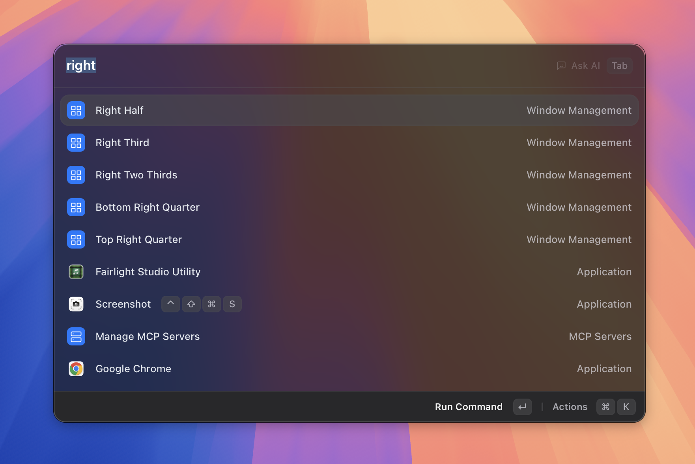

# Window Management

> Resize, arrange, and switch windows with layout presets and keyboard commands.

_Figure: the layout presets list._

## What it does

Window Management lets you instantly resize, reposition, move between displays, and switch between any open windows — without touching the mouse:

- **Layout Presets**: Instantly snap the frontmost window to halves, thirds, fourths, corners, or full screen.
- **Switch Windows**: Search and jump directly to any active application window across all workspaces.
- **Multi-Display Movement**: Move the active window between external monitors with single keystrokes.
- **Custom Layouts**: Save any window's current dimensions as a reusable layout that appears in search results and can be assigned a dedicated hotkey.
- **Undo Layout Changes**: Revert accidental moves instantly with **Restore Previous Bounds**.

## How to use it

### Apply layout presets

1. Switch to the application window you want to resize.
2. Open Asyar with your global hotkey.
3. Type part of the layout name — for example `left half`, `first fourth`, `center third`, or `maximize`.
4. Press `Enter`. The window snaps immediately, a brief heads-up confirmation appears, and Asyar dismisses.

### Switch between active windows

1. Open Asyar and type `switch windows` (or `switch` or `windows`).
2. Press `Enter` to open the **Switch Windows** view.
3. A live list of all open application windows appears, showing the application icon, application name, and window title.
4. Type in the search bar to filter by app name or window title.
5. Press `Enter` on any row to focus and raise that window immediately.

### Move across multiple monitors

If you use multiple displays, use display navigation commands:

- **Next Display**: Moves the frontmost window to the next monitor while preserving its relative size.
- **Previous Display**: Moves the frontmost window to the previous monitor.

### Manage custom layouts

1. Position and resize an app window to your desired dimensions.
2. Open Asyar, search for **Save Current Window as Layout**, and press `Enter` (or open **Manage Window Layouts**, press `⌘K`, and choose **Save Current Window as Layout**).
3. Give your layout a descriptive name (e.g. "Coding Left Split").
4. Your saved layout now appears in search results alongside built-in presets.
5. To rename or delete custom layouts, open **Manage Window Layouts**, select the layout, and choose **Rename** or **Delete** from the action panel (`⌘K`).

### Undo the last layout change

- Type `restore` in the search bar and press `Enter`, or search for **Restore Previous Bounds**.

## Shortcuts & actions

| Action                   | How                                                    |
| ------------------------ | ------------------------------------------------------ |
| Apply any preset         | Search its name, then `Enter`                          |
| Switch active windows    | Search `switch windows`, filter, then `Enter`          |
| Move to next display     | Search `next display`, then `Enter`                    |
| Move to previous display | Search `previous display`, then `Enter`                |
| Undo last layout         | Search `restore`, then `Enter`                         |
| Open action panel        | `⌘K` (in Manage Window Layouts or Switch Windows view) |

**Action panel (⌘K) entries in Manage Layouts:**

- **Save Current Window as Layout** — captures the active window's current bounds.
- **Rename** — renames the selected custom layout.
- **Delete** — removes the selected custom layout.

## Built-in presets

| Preset                      | What it does                              |
| --------------------------- | ----------------------------------------- |
| **Left Half**               | Left 50% of the screen                    |
| **Right Half**              | Right 50% of the screen                   |
| **Top Half**                | Top 50% of the screen                     |
| **Bottom Half**             | Bottom 50% of the screen                  |
| **Top Left Quarter**        | Top-left 25% corner                       |
| **Top Right Quarter**       | Top-right 25% corner                      |
| **Bottom Left Quarter**     | Bottom-left 25% corner                    |
| **Bottom Right Quarter**    | Bottom-right 25% corner                   |
| **Left Third**              | Left 33% column                           |
| **Center Third**            | Center 33% column                         |
| **Right Third**             | Right 33% column                          |
| **Left Two Thirds**         | Left 66% width                            |
| **Right Two Thirds**        | Right 66% width                           |
| **First Fourth**            | First 25% vertical column (leftmost)      |
| **Second Fourth**           | Second 25% vertical column (center-left)  |
| **Third Fourth**            | Third 25% vertical column (center-right)  |
| **Last Fourth**             | Fourth 25% vertical column (rightmost)    |
| **Center**                  | Centered window (80% width × 80% height)  |
| **Almost Maximize**         | Centered window (90% width × 90% height)  |
| **Maximize**                | Full screen                               |
| **Next Display**            | Move to next monitor                      |
| **Previous Display**        | Move to previous monitor                  |
| **Restore Previous Bounds** | Undo the single most recent layout change |

## Tips

- **Assign hotkeys for common splits**: Open **Settings → Extensions**, expand **Window Management**, and bind hotkeys like `⌃⌥←` for Left Half, `⌃⌥→` for Right Half, and `⌃⌥Enter` for Maximize.
- **Switch app first, then open Asyar**: Layout presets apply to whichever window was active immediately before summoning Asyar.
- **Vertical Fourths on ultrawide monitors**: The `First Fourth` through `Last Fourth` presets are ideal for 34"+ ultrawide and 4K displays where half-screen windows are too wide.
- **Restore only remembers one step**: Restore undoes the single most recent layout change.

## Related

- [The Basics](../the-basics.md)
- [Aliases & Shortcuts](./aliases-and-shortcuts.md)
- [Keyboard Shortcuts](../keyboard-shortcuts.md)
- [Walkthrough](./walkthrough.md)
