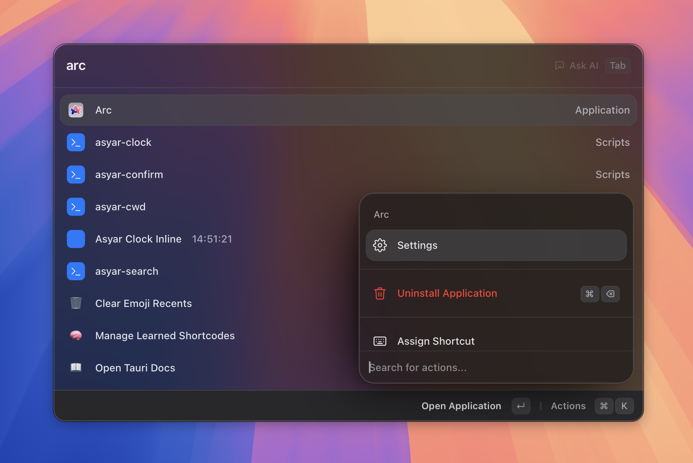

# Getting Started

> Install Asyar, finish first-run setup, and run your first search.

*Figure: the Asyar launcher, opened with the global hotkey.*
<!-- image-todo: getting-started-hero.png — launcher open over the desktop with a query typed -->

## Install
## First-run setup (hotkey, accessibility, theme)

*Figure: the onboarding step where you pick your global hotkey.*
<!-- image-todo: getting-started-onboarding.png — onboarding "Pick hotkey" step -->

## Your global hotkey
## Your first search
## Related
