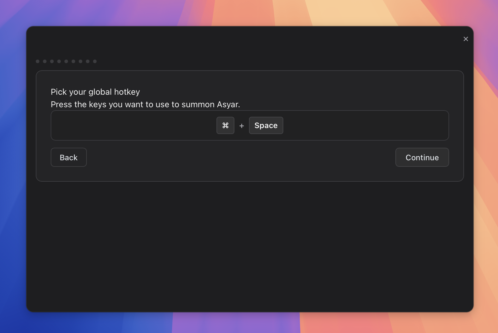

# Getting Started

> Install Asyar, finish first-run setup, and run your first search.

*Figure: the Asyar launcher, opened with the global hotkey.*

## Install

Download the latest release for your operating system from [asyar.org](https://asyar.org) and run the installer.

- **macOS:** Open the `.dmg`, drag Asyar to your Applications folder, then open it. Because Asyar is not yet on the Mac App Store, macOS may show a security prompt the first time — open **System Settings → Privacy & Security** and click **Open Anyway**.
- **Windows / Linux:** Run the downloaded installer and follow the on-screen steps.

Once Asyar starts, a small icon appears in the menu bar (macOS) or system tray (Windows/Linux) to confirm it is running. The onboarding flow opens automatically.

## First-run setup (hotkey, accessibility, theme)

*Figure: the onboarding step where you pick your global hotkey.*

Asyar walks you through a short onboarding flow the first time you launch it. Here is what each step does:

1. **Welcome** — A quick introduction. Click **Get started** to continue.

2. **Pick your global hotkey** — Press the key combination you want to use to summon Asyar from anywhere on your computer. Click inside the recorder, press your desired keys (for example, a modifier + letter), then click **Continue**. You can change this at any time in Settings.

3. **Grant accessibility access (macOS only)** — On macOS, Asyar uses the Accessibility API to paste text snippets and capture your selected text. Click **Open System Settings**, find Asyar in the list, and enable the toggle. Windows and Linux users can skip this step — it is not required there. On macOS, text expansion won't work until you grant it.

4. **Pick a theme** — Browse a selection of community themes and install one in one click, or stick with the built-in Asyar theme. This step is optional; you can change or add themes any time from the extension store.

5. **Try a few extensions** — Asyar shows a curated list of popular extensions for your platform. Check the ones you want and click **Install selected**, or click **Skip** to add extensions later from the built-in store.

6. **One-keystroke AI commands** — If you set up an AI provider, this step offers to create a **Grammar Fix** command: select text in any app, press the hotkey, and the selected text is replaced with the corrected version. You can skip this and create AI commands later.

7. **Done** — Onboarding is complete. Press your new hotkey to open the launcher.

You can re-run onboarding at any time from **Settings → General → Re-run onboarding**.

## Your global hotkey

The global hotkey you chose during setup shows or hides Asyar from anywhere on your computer — even when Asyar is not the active app. It works system-wide, so you do not need to switch apps first.

To change your hotkey after setup, open **Settings → General** (or **Settings → Shortcuts**) and click inside the shortcut recorder. Press your new combination and click **Save**.

If the hotkey stops working, see [Troubleshooting](./troubleshooting.md) for common causes.

## Your first search

Press the hotkey you chose during setup. The Asyar window appears in the centre of your screen with the search bar ready.

Start typing anything — an app name, a command, a URL, or a calculation. Results appear instantly as you type. Use `↑` and `↓` to move between results, then press `Enter` to run the selected one.

A few things to try right away:

- Type an app name (for example, "Safari") and press `Enter` to launch it.
- Type a URL (for example, "github.com") and press `Enter` to open it in your browser.
- Type a simple calculation (for example, "12 * 7") and see the answer in the results list.
- Press `⌘K` with any result selected to open the **action panel** and see what else you can do with that item.
- Press `Esc` to step back: it clears your search, closes anything you've opened, and finally hides Asyar.

Once you are comfortable with the basics, explore [The Basics](./the-basics.md) to learn how results are ranked, how the action panel works, and how to use the AI chip.

## Related

- [The Basics](./the-basics.md)
- [Keyboard Shortcuts](./keyboard-shortcuts.md)
- [Settings](./settings.md)
- [Troubleshooting](./troubleshooting.md)
