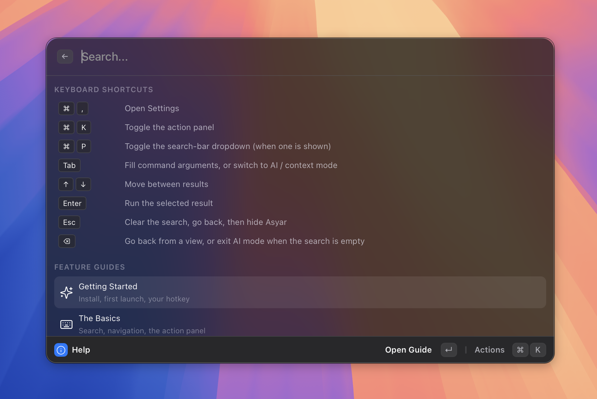

# Keyboard Shortcuts

> Every Asyar shortcut in one place. The same list appears in-app under "Help".

*Figure: the in-app Help view cheat sheet.*

## Global

These shortcuts work anywhere inside the Asyar launcher window.

| Shortcut | What it does |
|----------|-------------|
| The hotkey you chose during setup | Show or hide Asyar from anywhere on your computer |
| `⌘,` | Open Settings |
| `⌘K` | Toggle the action panel |
| `⌘P` | Toggle the search-bar dropdown (when one is shown) |
| `Tab` | Fill command arguments, or switch to AI / context mode |
| `↑` / `↓` | Move between results |
| `Enter` | Run the selected result |
| `Esc` | Clear the search → go back from a view → hide Asyar |

The show/hide hotkey is user-configurable. The exact keys depend on what you set during onboarding or in **Settings → Shortcuts**. It is never a fixed combination.

**Windows & Linux:** Asyar's shortcut display uses macOS symbols (⌘, ⌥, ⌃, ⇧). On Windows and Linux, use **Ctrl** wherever **⌘** is shown, and use the **Windows/Super** key where a Super-key shortcut is shown.

## In a view

These shortcuts apply when you have drilled into a result that opens a full view (for example, Clipboard History, Snippets, or an AI agent conversation).

| Shortcut | What it does |
|----------|-------------|
| `⌫` | Go back from the open view (when the search bar is empty), or exit AI mode |
| `Esc` | Follows the Escape behaviour you configured: step backwards, hide window, or reset launcher |
| `⌘K` | Toggle the action panel for the selected item in the view |

You can change what `Esc` does when a view is open in **Settings → Advanced → Escape Key**. The three options are:

- **Step Backwards** — clears the search first, then pops the view, then hides Asyar (the default).
- **Hide Window** — hides Asyar immediately without clearing state.
- **Reset Launcher** — hides Asyar and resets all state so the next open starts fresh.

## Per-feature

A few built-in features add extra shortcuts while their view is active.

**Snippets**

| Shortcut | What it does |
|----------|-------------|
| `⌘N` | Create a new snippet |
| `⌘⌫` | Delete the selected snippet |
| `⌘S` | Save changes when editing a snippet |

**Clipboard History**

| Shortcut | What it does |
|----------|-------------|
| `⌘⌫` | Delete the selected clipboard entry |

**Portals**

| Shortcut | What it does |
|----------|-------------|
| `⌘N` | Create a new portal |

For all other features, use `⌘K` to open the action panel — every available action for the selected item is listed there.

## Related

- [The Basics](./the-basics.md)
- [Getting Started](./getting-started.md)
- [Settings](./settings.md)
