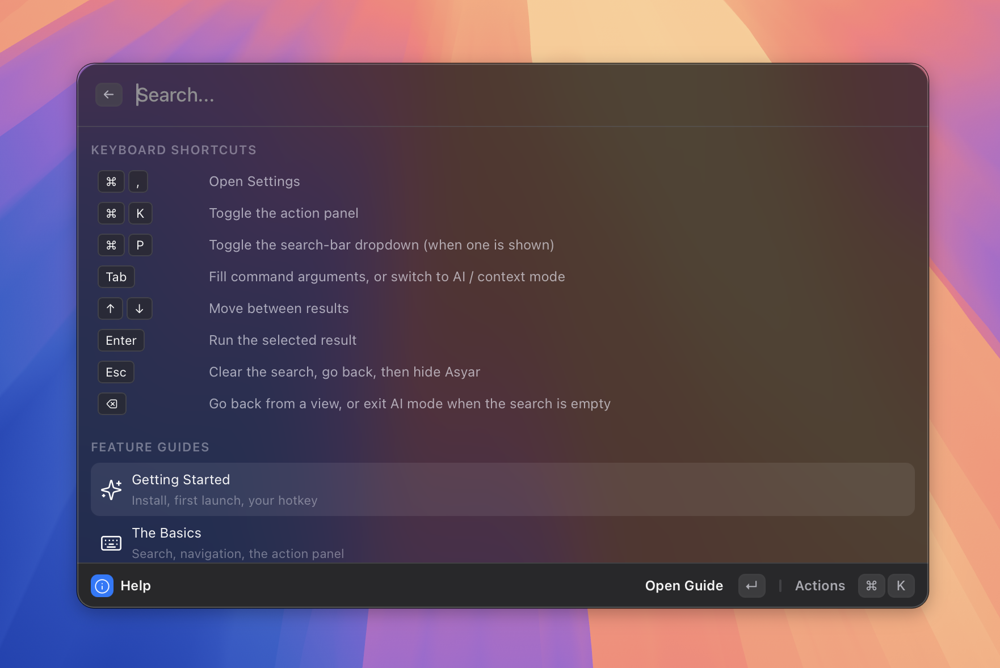

# Keyboard Shortcuts

> Every Asyar shortcut in one place. The same list appears in-app under "Help".

_Figure: the in-app Help view cheat sheet._

## Global

These shortcuts work anywhere inside the Asyar launcher window.

| Shortcut                          | What it does                                           |
| --------------------------------- | ------------------------------------------------------ |
| The hotkey you chose during setup | Show or hide Asyar from anywhere on your computer      |
| `⌘,`                              | Open Settings                                          |
| `⌘K`                              | Toggle the action panel                                |
| `⌘P`                              | Toggle the search-bar dropdown (when one is shown)     |
| `@`                               | Scope search exclusively to runnable commands          |
| `Tab`                             | Fill command arguments, or switch to AI / context mode |
| `↑` / `↓`                         | Move between results                                   |
| `Enter`                           | Run the selected result                                |
| `Esc`                             | Clear the search → go back from a view → hide Asyar    |

The show/hide hotkey is user-configurable in **Settings → Shortcuts**.

**Hyper Key (`✦`) Support:** If you configure a shortcut using all four modifiers (`Ctrl + Alt + Shift + Cmd/Super`), Asyar renders the combination with the clean `✦` glyph (e.g. `✦Space`).

**Standalone Function Keys (`F1`–`F24`):** Function keys (including extended keys `F13`–`F24` and the Windows Copilot key `F23`) can be assigned as hotkeys directly without requiring modifiers.

With an empty search field and the first result selected, press `↑` to recall the most recent query. Keep pressing `↑` for older queries and `↓` to move back toward an empty field. Asyar saves a query when you use a result or clear the field with `Esc`.

**Windows & Linux:** Action shortcuts (everything listed under _In a view_ and _Per-feature_, and the hints in the `⌘K` panel) adapt to your platform: **⌘** on macOS is **Ctrl** on Windows and Linux, so `⌘N` is `Ctrl+N` there. The tables below are written with the macOS symbols. Global hotkeys you record yourself keep the exact keys you pressed.

**Linux on Wayland:** Because Wayland protocol security blocks background hotkey grabs, assign your shortcut inside your desktop compositor settings to run the `asyar` command. Executing `asyar` while the daemon is running acts as a toggle.

## In a view

These shortcuts apply when you have drilled into a result that opens a full view (for example, Clipboard History, Snippets, Window Switcher, or an AI agent conversation).

| Shortcut | What it does                                                                                |
| -------- | ------------------------------------------------------------------------------------------- |
| `⌫`      | Go back from the open view (when the search bar is empty), or exit AI mode                  |
| `Esc`    | Follows the Escape behaviour you configured: step backwards, hide window, or reset launcher |
| `⌘K`     | Toggle the action panel for the selected item in the view                                   |

You can change what `Esc` does when a view is open in **Settings → Advanced → Escape Key**:

- **Step Backwards** — clears the search first, then pops the view, then hides Asyar (the default).
- **Hide Window** — hides Asyar immediately without clearing state.
- **Reset Launcher** — hides Asyar and resets all state so the next open starts fresh.

## Per-feature

A few built-in features add extra shortcuts while their view is active. Each one is declared on an action, so the same key is shown next to the action in the `⌘K` panel and pressing it runs the action. Shortcuts do nothing while the `⌘K` panel or a dialog is open, and they never take text-editing keys such as `⌘A`, `⌘C`, `⌘V`, `⌘X`, `⌘Z` or `⌘⌫`. Destructive actions (delete, trash, uninstall) have no direct shortcut and live in the `⌘K` panel only.

**Notes**

| Shortcut | What it does  |
| -------- | ------------- |
| `⌘N`     | Create a note |

**Snippets**

| Shortcut | What it does                        |
| -------- | ----------------------------------- |
| `⌘N`     | Create a new snippet                |
| `⌘S`     | Save changes when editing a snippet |

**Clipboard History**

| Shortcut    | What it does                      |
| ----------- | --------------------------------- |
| `Enter`     | Paste selected item               |
| `⇧Enter`    | Paste as plain text               |
| `⌘↑` / `⌘↓` | Extend selection for merged paste |

**AI & Agents (Chat View)**

| Shortcut          | What it does                             |
| ----------------- | ---------------------------------------- |
| `Enter`           | Send user message or follow-up prompt    |
| `⌘⇧C`             | Copy the assistant's last reply directly |
| `⌘N`              | Start a clean conversation thread        |
| `⌘K` → Cancel Run | Abort an active streaming response       |

**Window Management (Switch Windows View)**

| Shortcut | What it does                                    |
| -------- | ----------------------------------------------- |
| `Enter`  | Switch immediately to the selected window       |
| `⌘W`     | Close the selected window                       |
| `⌘⇧C`    | Copy the window title                           |
| `⌘N`     | Save the current window layout (Manage Layouts) |
| `⌘R`     | Rename the selected layout                      |
| `⌘K`     | Open actions for the selected window or layout  |

**File Search**

| Shortcut     | What it does                              |
| ------------ | ----------------------------------------- |
| `Space`      | Quick Look preview of the selected file   |
| `⌘R`         | Reveal in Finder                          |
| `⌘⇧C`        | Copy Path                                 |
| `⌘⌥C`        | Copy Name                                 |
| `⌘T`         | Open in Terminal                          |
| `⌘⇧P`        | Toggle Pin                                |
| `Tab` / `⌘I` | Send to Asyar AI                          |
| `⌘⇧F`        | Search Everywhere (deep OS-native search) |

**Screen OCR**

| Shortcut | What it does                                  |
| -------- | --------------------------------------------- |
| `Esc`    | Cancel interactive screen selection crosshair |

**Portals**

| Shortcut | What it does        |
| -------- | ------------------- |
| `⌘N`     | Create a new portal |

For all other features, use `⌘K` to open the action panel — every available action for the selected item is listed there.

## Related

- [The Basics](./the-basics.md)
- [Getting Started](./getting-started.md)
- [Settings](./settings.md)
- [Window Management](./features/window-management.md)
- [Screen OCR](./features/screen-ocr.md)
