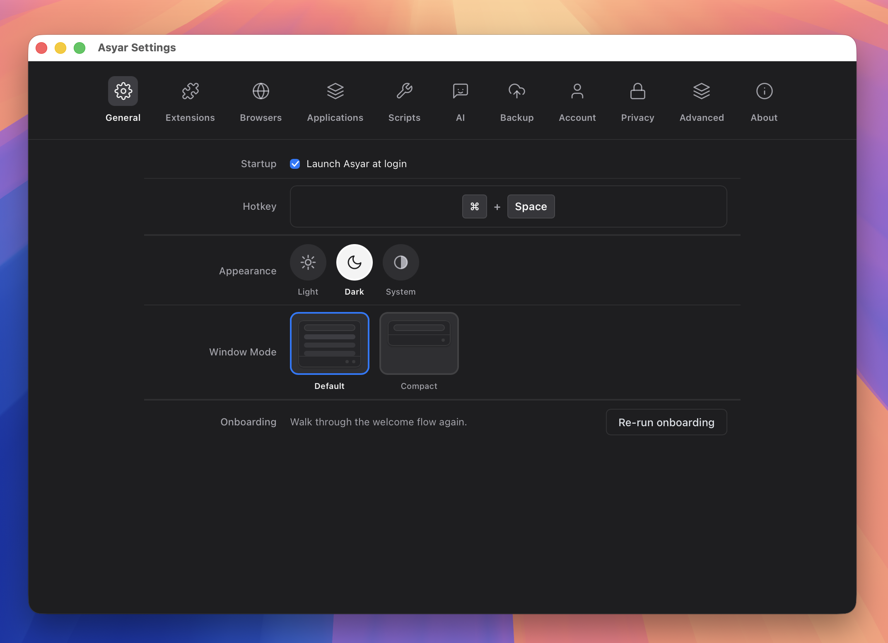

# Settings

> A tour of every settings tab.

*Figure: the General settings tab.*

Open Settings with `⌘,` from anywhere inside the launcher, or search for "Settings" and press `Enter`. The window is divided into tabs along the top.

## General

The General tab covers the most common settings:

- **Startup** — Toggle "Launch Asyar at login" to have Asyar start automatically when you log in to your computer.
- **Hotkey** — Change the global show/hide shortcut. Click inside the recorder, press your new combination, and click Save.
- **Appearance** — Switch between Light, Dark, or System (follows your operating system) colour scheme.
- **Window Mode** — Choose between Default (search bar + results list visible immediately) and Compact (search bar only; results expand when you type).
- **Custom Themes** — If you have installed community themes, a theme picker appears here. Select a theme to apply it instantly.
- **Onboarding** — Click "Re-run onboarding" to walk through the welcome flow again — useful if you skipped any steps the first time.

## Appearance

The Appearance tab gives you a larger visual picker for the same settings:

- **App Theme** — Three large swatches for System, Light, and Dark. Click one to apply it.
- **Launch View** — Visual preview cards for Default and Compact window modes. Click one to switch immediately.
- **Custom Themes** — If you have installed custom themes from the store, they appear here as selectable tiles alongside the built-in Default theme.

## Shortcuts

The Shortcuts tab has one purpose: changing the global activation shortcut.

- **Asyar activation shortcut** — Click inside the recorder and press the key combination you want. Asyar checks for conflicts with other registered shortcuts and warns you if the combination is already in use. Click Save to apply it.

All other per-item shortcuts (for commands, snippets, scripts, and agents) are managed from the **Applications & Extensions** tab and from each item's row in the launcher.

## Applications & Extensions

This tab has two sub-sections that share a tab.

**Applications** lets you control which apps Asyar indexes:

- **Scan directories** — Asyar scans your Applications folder by default. Click "Add Directory" to add more folders (for example, a custom tools folder). Default folders are shown as read-only; custom folders can be removed.
- **Per-app toggles** — A list of every discovered app. You can hide individual apps from search results by turning off their toggle. You can also assign a keyboard shortcut or a search alias to any app from its row.

**Extensions** (the Extensions tab) lists all installed extensions with their commands:

- Enable or disable an individual extension with its toggle.
- Assign a keyboard shortcut or alias to any command from its row.
- Install an extension from a file using the "Install from file" button.
- Update available extensions from this view. Auto-update behaviour is controlled in Advanced.

## AI, MCP & Browsers

This section is split across two related tabs.

**AI** tab:

- **Tab continues last thread** — When on, pressing `Tab` to enter AI mode resumes your previous conversation instead of starting a new one.
- **Providers** — Add one or more AI providers (Anthropic, OpenAI, OpenRouter, Google, Ollama, or a custom endpoint). For each provider, configure your API key and choose a model. Click the star (★) next to a provider to make it the default — this is what the AI chip uses when you press `Tab` in the launcher.
- **Advanced AI settings** — Max tokens and temperature controls for fine-tuning AI responses.
- **Manage Agents** — Open the Agents view to create, edit, and assign hotkeys to AI agents.
- **MCP** — Connect Model Context Protocol servers to give your AI agents access to external tools and data. Each server you add expands what your agents can do.

**Browsers** tab:

- **Connected browsers** — Shows which browsers have the Asyar companion extension installed and paired. A paired browser shares its open tabs, bookmarks, and history with Asyar's search.
- **Pending pairings** — When a browser requests pairing, a prompt appears here. Allow or deny each request.
- **Paired browser list** — Revoke a pairing at any time by clicking Remove next to the browser name.

## Privacy, Scripts & Advanced

**Privacy** tab:

- **Encryption status** — Shows whether Asyar's local data store is encrypted on disk.
- **Clipboard privacy** — Configure rules to prevent certain apps or patterns from being captured in Clipboard History.
- **Secret redaction** — Automatically strip API keys and tokens from clipboard entries before they are stored.

**Scripts** tab:

- **Script directories** — Add folder paths that Asyar should watch for executable scripts. Any script placed in a watched folder is discoverable from the launcher immediately — no restart required. Remove a folder to stop watching it.

**Advanced** tab:

- **Extension Search** — Toggle whether installed extensions can contribute results to the main search bar.
- **Extension Actions** — Toggle whether extensions can add actions to the main action panel (`⌘K`). When off, only Asyar's built-in actions appear.
- **Escape Key** — Choose how `Esc` behaves when a view is open: Step Backwards (default), Hide Window, or Reset Launcher.
- **Auto Updates** — Extensions update silently in the background when this is on.
- **Text Expansion** — Enable or disable snippet text expansion. Requires Accessibility permission on macOS (macOS only).
- **Developer Mode** — Unlocks the extension inspector, verbose logging, and extension sideloading. Intended for extension developers.

## Account, Backup & About

**Account** tab:

- **Sign in** — Sign in with GitHub or Google to get access to cloud sync, AI conversation history sync, and premium features. See [Sync & Backup](./sync-and-backup.md) for full details.
- **Features** — Shows which subscription features are active on your account.
- **Subscription** — Opens your subscription management page on asyar.org.
- **Cloud Sync** — Shows the last sync time and lets you trigger a manual sync. Requires an active subscription.
- **Encrypted Sync** — Toggle end-to-end encryption for synced data. See [Sync & Backup](./sync-and-backup.md) for details.

**Backup** tab:

- **Export** — Select which data categories to include, optionally set a password, and click Export to save a local backup file.
- **Import** — Choose a backup file to restore from. You can pick which categories to restore and how to handle conflicts (Merge, Replace, or Skip).

**About** tab:

- **Version** — Shows the current Asyar version.
- **Update channel** — Switch between Stable and Beta update channels.
- **Check for updates** — Manually trigger an update check. If an update is available, you can download and install it from here without leaving the app.

## Related

- [Sync & Backup](./sync-and-backup.md)
- [Getting Started](./getting-started.md)
- [Keyboard Shortcuts](./keyboard-shortcuts.md)
- [Troubleshooting](./troubleshooting.md)
