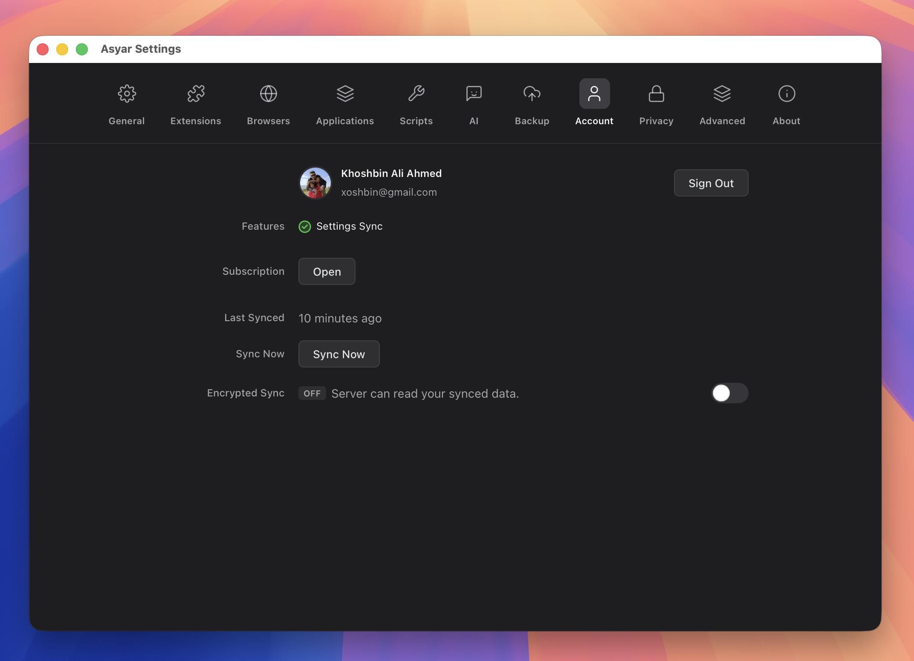

# Sync & Backup

> Your account, cloud sync, end-to-end encryption, and local backups.

*Figure: the Account settings tab.*
<!-- image-todo: sync-account-tab.png — the Account settings tab -->

## Signing in

Asyar uses your Asyar account for cloud sync and subscription features. Signing in is optional — Asyar works fully offline without an account.

To sign in:

1. Open **Settings → Account** (`⌘,`, then the Account tab).
2. Click **Sign in with GitHub** or **Sign in with Google**.
3. A browser window opens for authentication. Complete the login there.
4. Asyar polls for confirmation. Once your browser finishes, the launcher updates automatically.

After signing in, your name, avatar, and the list of features unlocked by your subscription appear at the top of the Account tab. To sign out, click **Sign Out** next to your profile.

By signing in you agree to the Asyar Terms of Service and Privacy Policy.

## Cloud sync

Cloud sync keeps your settings, commands, and AI conversation history in sync across multiple devices — or simply backed up to the cloud. It requires an active subscription with the sync entitlement.

When sync is enabled:

- Asyar syncs automatically in the background.
- The **Last Synced** row in the Account tab shows when the most recent sync completed.
- Click **Sync Now** to trigger a manual sync at any time.

If a sync error occurs, an error message appears below the Last Synced row.

Cloud sync is always on for eligible accounts — there is no separate toggle to enable it once the entitlement is active.

## End-to-end encryption

By default, your synced data is stored on Asyar's servers in a form the server can read. End-to-end encryption (E2EE) changes this: your data is encrypted on your device before it leaves, and the server stores only ciphertext it cannot decrypt.

**Enabling E2EE:**

1. In **Settings → Account**, find the **Encrypted Sync** row and turn on the toggle.
2. An enrolment dialog opens. You will be asked to create a passphrase — choose something strong that you can remember, because it cannot be recovered from the server side.
3. Asyar also generates a **recovery phrase** (a mnemonic word list). Store this somewhere safe — it is the only way to regain access if you forget your passphrase.
4. Once you confirm, encryption is active. The status badge changes to "On" with a green indicator.

**Daily use:**

When E2EE is on, Asyar caches the decryption key on your device so you do not need to enter your passphrase on every sync. If the cache is cleared (for example, after a reinstall), the status shows **Locked** and you will be prompted to enter your passphrase once to unlock it.

**Managing your passphrase:**

From the Account tab, when E2EE is enabled, you have three options:

- **Enter passphrase** — Unlocks the cached key when the status is Locked.
- **Change passphrase** — Rotate to a new passphrase (requires entering the current one first).
- **View recovery phrase** — Shows your mnemonic word list so you can copy it to a safe location.
- **I forgot my passphrase** — Lets you recover access using your recovery phrase if you have it written down.

**Disabling E2EE:**

Turn off the Encrypted Sync toggle and confirm the dialog. Your data will be re-uploaded in unencrypted form on the next sync.

## Export & import a backup

Local backups let you save a snapshot of your Asyar data to a file and restore it on the same computer or a different one — independent of cloud sync.

**Exporting a backup:**

1. Open **Settings → Backup**.
2. Check the data categories you want to include (for example, Snippets, Agents, Shortcuts).
3. If the backup includes sensitive data such as API keys, Asyar warns you. You can set an optional password to encrypt the file; if you leave it blank, sensitive fields are stripped from the exported file automatically.
4. Click **Export…** and choose where to save the file.

**Importing a backup:**

1. Open **Settings → Backup**.
2. Click **Choose Backup File…** and select a previously exported backup.
3. If the file is password-protected, enter the password when prompted.
4. A preview dialog shows each category in the backup along with counts (local vs. incoming) and any conflicts.
5. For each category, choose how to handle conflicts: **Merge** (keep both), **Replace** (overwrite with backup data), or **Skip** (leave your current data untouched).
6. Click **Restore** to apply.

## Related

- [Settings](./settings.md)
- [FAQ](./faq.md)
- [Troubleshooting](./troubleshooting.md)
