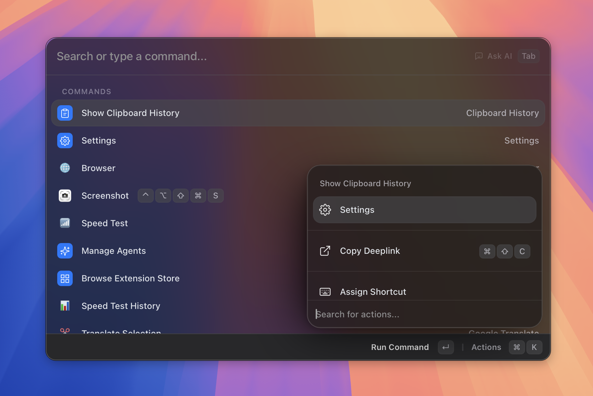

# The Basics

> How search, results, navigation, and the action panel fit together.

*Figure: results list with the action panel visible.*

## The search bar

When you open Asyar with your global hotkey, the cursor is already in the search bar. Just start typing — there is no need to click.

The search bar does several things depending on what you type and which features are active:

- **Plain text** — Asyar searches your apps, commands, snippets, files, and installed extensions in real time.
- **URLs** — Type a URL and press `Enter` to open it directly in your browser.
- **Calculations** — Type a maths expression and the result appears immediately in the list.
- **AI mode** — When the AI chip is visible at the right of the search bar, press `Tab` to enter AI mode and ask a question (see [The AI chip and Tab](#the-ai-chip-and-tab) below).
- **Command arguments** — If the selected result is a command that expects inputs, press `Tab` to fill in its argument fields before running.

A dropdown can appear beside the search bar for some commands to let you pick a scope or filter. Press `⌘P` to toggle that dropdown when it is visible.

## Results & how they're ranked

Asyar ranks results by relevance. The most important factors are:

- **How well the name matches** your query (exact prefix matches rise to the top).
- **How often you use** a result — Asyar learns your habits and promotes items you run frequently.
- **What type it is** — Built-in commands and installed extensions can declare a high-priority tier so their results always appear near the top for the right queries.

Results from multiple sources — apps, commands, AI agents, browser bookmarks, clipboard history, and more — are merged into a single list. You do not need to switch modes to find things.

## Navigating with the keyboard

Asyar is designed to be used entirely with the keyboard:

| Key | What it does |
|-----|-------------|
| `↑` / `↓` | Move up and down through the results list |
| `Enter` | Run the selected result (launch app, execute command, open URL, etc.) |
| `⌘K` | Open the action panel for the selected result |
| `Tab` | Fill command arguments, or switch to AI / context mode |
| `⌘P` | Toggle the search-bar dropdown (when one is shown) |
| `⌘,` | Open Settings |
| `Esc` | Clear the search → go back from a view → hide Asyar |
| `⌫` | Go back from an open view, or exit AI mode when the search bar is empty |

Asyar keeps focus in the search bar automatically. You can click a result to select it, but you do not have to.

## The action panel (⌘K)

Every result in Asyar can have multiple actions beyond the default one. Press `⌘K` with a result selected (or highlighted) to open the **action panel** at the bottom of the window.

The action panel shows all available actions for that item. For example, an application might offer actions like Open, Reveal in Finder, or Hide All Windows. A command might offer Edit or Delete.

Use `↑` / `↓` inside the action panel to move between actions, then press `Enter` to run one. Press `Esc`, `⌫`, or `⌘K` again to close the panel without taking any action.

Extensions can also contribute their own actions to the panel, so the list grows as you install more extensions.

## The AI chip and Tab

When you have an AI provider configured, a small chip appears at the right side of the search bar — for example, "Ask AI". This chip tells you that pressing `Tab` will switch to AI mode using that provider.

Once you press `Tab`:

- The chip becomes active and the search bar transforms into an AI input.
- Type your question or prompt, then press `Enter` to send it.
- The AI response appears in the launcher.
- Press `⌫` when the input is empty to exit AI mode and return to normal search.

You can configure which AI provider powers the chip, and add multiple AI providers, in **Settings → AI**.

AI agents can also be assigned a direct hotkey during onboarding or from the Manage Agents view, so you can invoke a specific agent without opening the launcher at all.

## Command arguments

Some commands declare inline argument fields — for example, a "Create Note" command might ask for a title before running. When you select such a command in the results list, a `Tab` hint appears in the search bar.

Press `Tab` to enter argument mode. A row of input chips appears below the search bar, one for each declared argument. Fill in the fields and press `Enter` to run the command with those inputs.

Asyar remembers the last value you typed for each argument field, so repeat invocations are fast.

To exit argument mode without running the command, press `Esc` or `⌫`.

## Related

- [Getting Started](./getting-started.md)
- [Keyboard Shortcuts](./keyboard-shortcuts.md)
- [Settings](./settings.md)
- [AI & Agents](./features/ai-and-agents.md)
